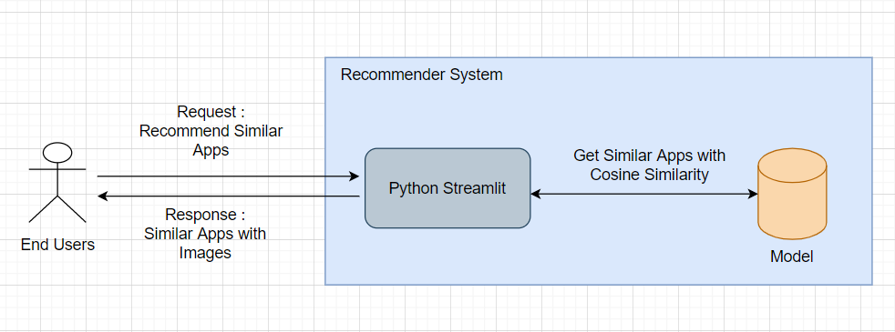
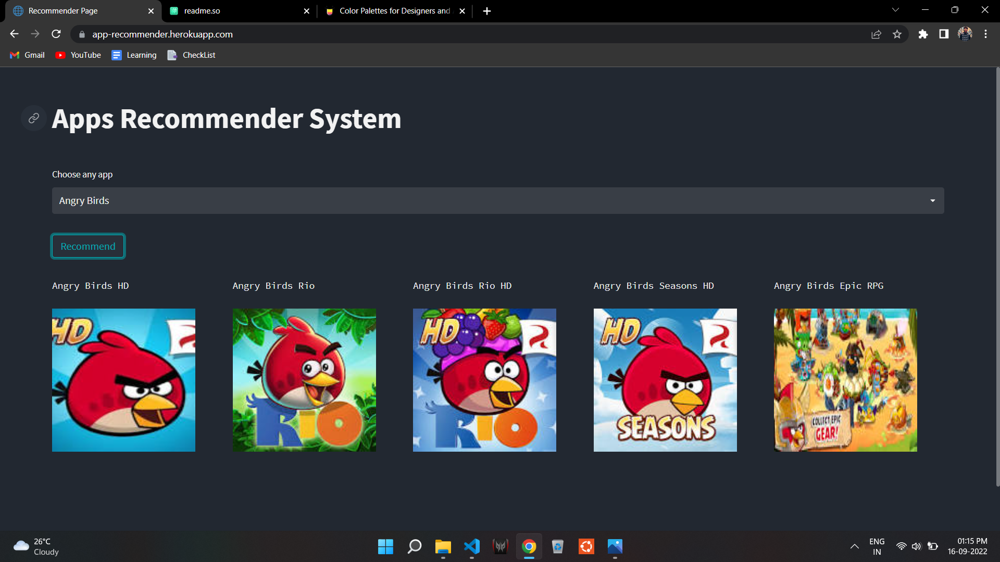

# Apps Recommender System

  

This project's main goal is to produce app recommendations using information from the Apple App Store. 
The term "system" may occasionally be replaced with a synonym, such as "platform" or "engine," in a recommendation system, 
also known as a recommendation system, 
which suggests items most relevant to a certain user.

This model uses a Content Based Recommender System, which analyses the developer's description of the apps and suggests apps that are similar to the apps that users like.

## Architechture

## Screenshot

## Project Execution

1. Install this repository locally by cloning it or downloading it.
2. Using the command `pip install -r requirements.txt`, install every library included in the requirements.txt file.
3. Run the file `main.py` by using the command `streamlit run main.py` at the terminal or command line after opening your project directory (Website directory).
4. Cheers! The website will launch.

        Note : Specific requirements.txt is also there in Model directory to execute the notebook.Here I have not uploaded the model pickle file and data pickle file(which is used in deployment), to get that run the notebook by following the above steps and paste those files in Website directory for proper execution. 
## Core Concept

1. Create tags from data (Input for Model)
2. A fantastic utility offered by the Python scikit-learn module is Count Vectorizer. It is employed to convert a given text into a vector based on the frequency (count) of each word that appears across the text as a whole.
3. Once Vectors are created from tags that is given to Cosine Similarity
4. The cosine similarity index calculates how similar two vectors in an inner product space are to one another. It establishes whether two vectors are roughly pointing in the same direction by calculating the cosine of the angle between them. In text analysis, it is frequently used to gauge document similarity.
5. Following this idea we build this model.
## Links

1. Dataset - https://www.kaggle.com/datasets/ramamet4/app-store-apple-data-set-10k-apps
2. Website - https://app-recommender.herokuapp.com/
